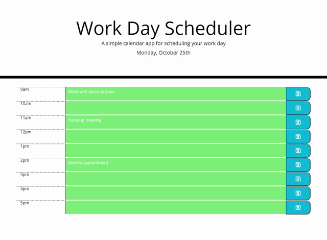

## Workday Scheduler
- This is a simple workday planner application created using HTML, Javascript, and CSS. 
- It uses BootStrap CSS framework, JQuery and Moment javascript library to work with date and time.

## General Information
I took the starter code that was supplied and added the following functionality to it:
- Updated the header with the current date.
- Added timeblocks for each hour from 9am to 5pm.
- Ensured that each timeblock was color coded according as the hour was in the past, present or future.
- Added text areas and save buttons to each timeblock to allow user to enter and save hourly schedule details.
- Ensured that save button click saves the hourly plan details to local storage.
- When the page loads, it loads saved workday schedule details from local storage and displays it.

## Screenshot

## Deployed URL

## Repository

